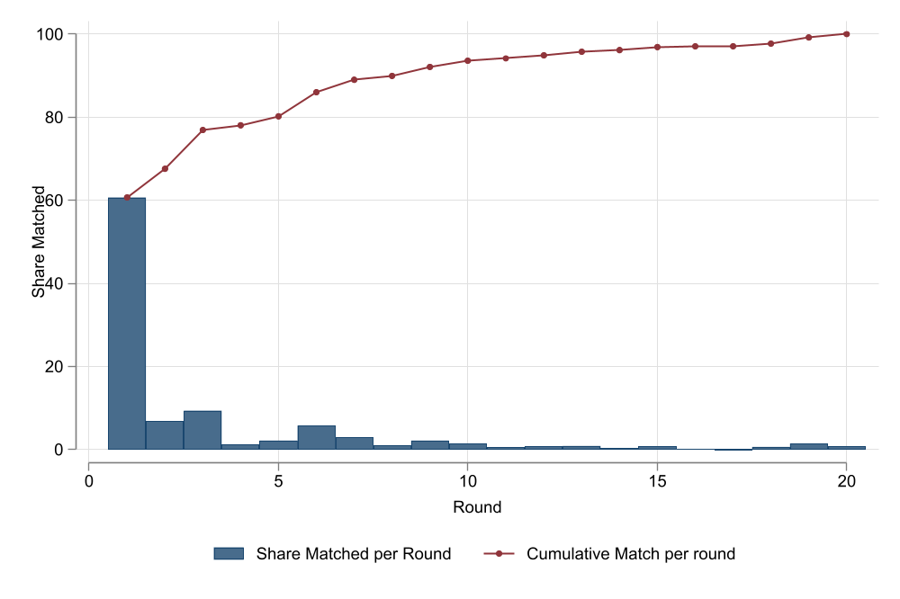
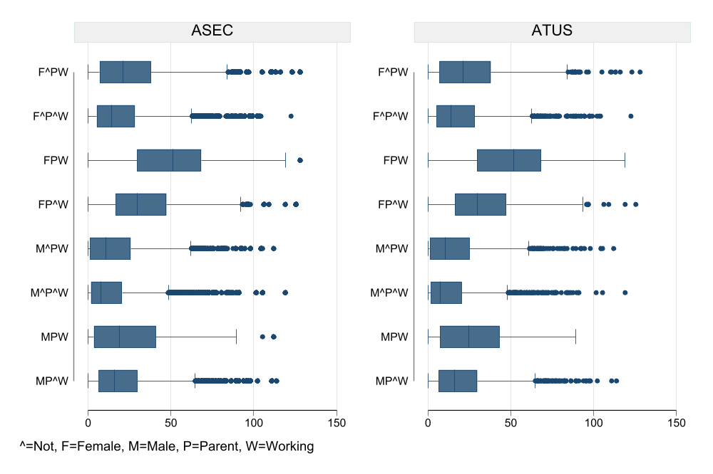

# Introduction

This paper describes the construction of the synthetic dataset created for use in the estimation of the Levy Institute Measure of Economic Well-Being (LIMEW) for the United States. The LIMEW was developed as an alternative to conventional income measures that provides a more comprehensive measure of economic well-being. Construction of the LIMEW requires a variety of information for households. In addition to the standard demographic and household income information, the estimation process also requires information about household members' time use and information on a household's wealth, assets, and debts. Unfortunately, no single dataset contains all required data for the estimation.

In order to produce LIMEW estimates, a synthetic dataset is created combining information from three datasets, applying a statistical matching process. For current elaboration of this dataset, the Annual Social and Economic Supplement (ASEC) of the Current Population Survey (CPS)  is used as the base dataset, as it contains good information regarding demographic, social, and economic characteristics, as well as income, work experience, noncash benefits, and migration status of persons 15 years old and over. Time use data comes from the American Time Use Survey (ATUS) , which provides rich data regarding how people divide their time among life's activities, including time spent doing paid and unpaid activities, inside and outside the household, for one person in the household. Wealth data come from the Survey of Consumers Finances (SCF) , which collects detailed information on household finances, income, assets, and liabilities.

This paper is organized as follows. Section one describes the data. Section two assesses the alignment of the information between ASEC and ATUS at the individual level, and the ASEC and the SCF at the household level. Section three briefly describes the methodology and analyzes the matching quality of the statistical matching. Section four concludes.

# Data Description

## Annual Social Economics Supplement (ASEC)

The CPS is a monthly survey administered by the US Bureau of Labor Statistics. It is used to assess the activities of the population and provide statistics related to employment and unemployment in the current labor market. Each household in the CPS is interviewed for four consecutive months, not interviewed for eight, and interviewed again for four additional months. Although the main purpose of the survey is to collect information on the labor market situation, the survey also collects detailed information on demographic characteristics (age, sex, race, and marital status), educational attainment, and family structure.

In March of every year, the previously interviewed households answer additional questions, part of the ASEC supplement formerly known as the Annual Demographic File. In addition to the basic monthly information, this supplement provides additional data on work experience, income, noncash benefits, and migration.

The ASEC  is used as the base dataset (recipient), as it contains rich information regarding demographics and economic status. Because the time use survey (described below) covers individuals 15 years of age and older, younger individuals are discarded from the ASEC sample. This leaves us with a total of  observations, representing  individuals when weighted. For the household-level analysis, only information regarding the householder is used, leaving  observations, representing  households when weighted.

## American Time Use Survey (ATUS)

The ATUS, a survey sponsored by the Bureau of Labor Statistics and collected by the US Census Bureau, is the first continuous survey on time use in the United States available since 2003. Its main objective is to provide nationally representative estimates of peoples' allocation of time among different activities, collecting information on what they did, where they were, and with whom they were.

The ATUS is administered to a random sample of individuals selected from a set of eligible households that have completed their final month's interviews for the CPS. The ATUS covers all residents who are at least 15 years old and are part of the civilian, noninstitutionalized population in the United States.

The ATUS , which contains a total of  observations, is used as the donor dataset to obtain information regarding time use, which will be transferred to the ASEC . Since information regarding household income is incomplete, the information was imputed using a univariate imputation process and information from the ASEC . The sample represents a total of 248,718,989 individuals.

## Survey of Consumer Finances (SCF)

The SCF is normally a triennial cross-sectional survey, sponsored by the Board of Governors of the Federal Reserve System in cooperation with the US Department of the Treasury, which collects information on families' balance sheets, pensions, income, and demographic characteristics.4 The purpose of the survey is to provide detailed information on households' assets and liabilities that can be used for analyzing households' wealth and their use of financial services.

In order to provide reliable information on household wealth distribution, the SCF is based on a dual-frame sample design. On the one hand, a geographically based random sample of respondents is interviewed to obtain a sample that is broadly representative of the population as a whole. On the other hand, a supplemental sample is obtained to include a sample of wealthy families in order to provide accurate information on wealth distribution, as the distribution of nonhome assets and liabilities is highly concentrated. In order to deal with the missing data, most variables with missing values are imputed using a multiple imputation procedure from which five replicates (imputations) for each record are obtained.

The SCF  is used as the donor dataset to obtain information regarding assets, debts, and net worth. For the SCF , a total of  families/households were interviewed. In order to account for the multiple imputation information, the five replicates are combined and used for the matching procedure. This provides a sample of  observations, representing  households when weighted.

# Methodology

In order to create synthetic datasets that combine data from the different sources into a single dataset, we employ a methododology known as statistical matching.

The basic Statistical matching setup consists of having access to two sources of data: survey A and survey B, which collect information from two independent samples of the same population. Survey A collects information $Z, X$, whereas survey B collects information $Z, Y$. Although both surveys collect common information $Z$ (for example demographics), they each contain information on variables that are not observed jointly: $X$ (Consumption) and $Y$ (Time use). In this case, the goal of Statistical matching is to create synthetic data that will contain all information $Y,X, Z$, linking observations across the datasets based on how close they are based on observed characteristics. It is also possible to constrain matches based on the weighted population each survey represents.

In turn, this synthetic dataset should allow researchers to analyze otherwise unobservable relationships between, $X$ and $Y$, or as in our case, income and time use (**D. Orazio et al, 2006; Rasseler, 2002**). Thus, inference on the relation between $X$ and $Y$ can only be done to the extent that $Z$ explains most of the common variation between $X$ and $Y$.

## Matching Algorithm

As described in **Lewaa et al (2021)**, statistical matching could be considered as a non-parametric variation of the stochastic regression approach, where no specific distribution assumption is imposed, and the imputed values are drawn directly from the observed distribution in the donor file. In particular, we implement a variation of the rank-constrained statistical matching described in **Kum and Masterson (2010)**, which improves on the approach by using a weight splitting approach in combination with clustering analysis for a better automatic selection of strata groups in the approach.\[\^ This is in contrast with previous iterations of Statistical matching used for the estimation of the LIMEW, which was based on ex-ante ad-hoc stratification, last-match-unit approach\].

The statistical matching procedure applied for the paper is a multi-step process that can be explained as follows:

### Step 1: Data harmonization

The first step involves harmonizing all common variables that will be used in the matching process and survey balancing. This is a necessary step in all imputation methods because variables need to have consistent definitions before they can be utilized for imputation using regression models.

Furthermore, this step includes adjusting sample weights to ensure that the weighted population is the same across all surveys. The standard practice is to adjust the sample weights of the donor sample. Additionally, for technical reasons, the weights are adjusted to whole numbers. While it is customary to adjust weights to match the total population, it may also be advisable to adjust weights to align with subpopulations based on selected strata variables.

Lastly, it is recommended to verify if both the donor and recipient files truly represent the same population by comparing the means, variances, and proportions of key variables across both surveys. In instances where significant imbalances are observed, reweighted methods can be employed to improve the balance between the surveys. However, there is no definitive rule to determine when a discrepancy in the distribution constitutes a substantial imbalance.

### Step 2. Strata and Cluster identification, and propensity score estimation

The second step involves identifying statistically similar records based on observed characteristics Z. This is accomplished through a combination of three methodologies:

-   **Principal Component Analysis (PCA)**: PCA is utilized as a data reduction technique to decrease the dimensionality of Z to a few linear combinations. While there are numerous suggestions on determining the optimal number of components, we simply select the first few components that explain approximately 50% of the data's variation.

-   **Cluster analysis**: Once the principal components are estimated, they are employed to identify clusters within the dataset using a k-means cluster iterative partition algorithm. A brief description of the algorithm can be found in Hastie et al. (2009).

    As this algorithm only discovers locally optimal clusters and their identification is influenced by random initial conditions, it has a tendency to generate suboptimal clusters. To mitigate this issue, we modify the algorithm by repeating the procedure a sufficient number of times and selecting the "optimal" cluster based on the largest Calinski-Harabasz pseudo-F index (Calinski and Harabasz, 1974). This ensures that the chosen cluster maximizes intra-cluster similarity while minimizing inter-cluster dissimilarity.

    This procedure generates various sets of clusters of different sizes. The clusters with the highest number of groups are prioritized in the statistical matching procedure since they represent the most similar records, while clusters with fewer groups are utilized in later stages of the matching process.

-   **Propensity score matching:** To enhance the matching procedure, we estimate a propensity score using a logit model. The dependent variable in the model is a binary indicator that determines whether an observation belongs to the donor or recipient file, while the independent variables consist of all common variables Z (including interactions or transformations). In the scenario where both surveys can be considered random samples from the same population, the expected coefficients for all variables should be zero or statistically insignificant. However, due to sampling variability and variations in survey design, it is common to observe variation in the propensity score. The logit model and propensity score can be estimated for the entire pooled survey or using the primary strata variables.

### Step 3. Matching and weight splitting.

Once the propensity score has been estimated and the clusters and strata have been defined, we proceed with our matching algorithm. We rank all observations within each group, called cells, using the propensity score. The most detailed cluster, which defines the largest number of groups, is used for this purpose.

Within each cell, the record with the lowest propensity score from the donor file is matched or linked to the record with the lowest propensity score in the recipient file. If both records have the same weight, they are considered as fully matched and removed from the donor or recipient pool. If the weights are different, the record (donor or recipient) with the lowest weight is removed from the pool, and the weight of the matched record is adjusted by subtracting the weight value of the excluded record. The adjusted weight is retained in the pool for a subsequent match.

This process of matching records and adjusting weights, if necessary, continues until there are no more donor or recipient records left in that cell. If there are unmatched records from the previous steps, the procedure is repeated using a less detailed cluster until all records from the donor and recipient files are matched. Once the matching is completed, we obtain a synthetic dataset where all records in the donor file are matched to potentially multiple records in the recipient files, and vice versa.

For the final synthetic dataset, we select the "best" matched records, which are those that were matched in the earlier stages (most detailed clusters) or are records matched with the largest split weight. In case of ties, the "best" match is randomly chosen.

Due to this step, some observations in the donor sample may not be used at all, while others may be used more frequently than their weight would suggest. However, if the sample sizes and weight structures across both files are similar, we can expect only minor discrepancies between the distribution of the imputed data in the donor and recipient datasets. Nevertheless, if the sample sizes differ significantly, it is advisable to use the largest file as the recipient file.

The statistical matching procedure described above aims to impute all missing values in the recipient file by transferring the observed distribution of the imputed values from the donor file. This transfer of information is achieved by linking records from the donor file to records in the recipient files that have similar characteristics or similar ranks, based on an index known as the propensity score, which summarizes all those characteristics. Its main advantage over other methodologies is that constrained statistical matching fully recovers the distribution of the donor sample in the imputed sample, except for minor discrepancies as explained earlier.

# Data Aligment and Statistics

## ATUS  -- ASEC 

In order to create the synthetic dataset and transfer the time use information from the donor to the recipient dataset we need to verify that the distribution of information across surveys is comparable. To do so, we compare the distribution of individuals across the following set of variables: Gender, Parental Status, labor force Status, Presence of a Spouse, and employment status of the spouse. Since both datasets were collected within one year of each other, one should expect them to be well aligned.


```{stata}
*| echo: false
*| output: false
clear all
frame create atus_cps
frame change atus_cps

use atus_cps_19, clear

tab survey [w=nwgt],     matcell(ms0)
tab sex            survey [w=nwgt],     matcell(ms1)
tab parentyn       survey [w=nwgt],     matcell(ms2)
tab emp            survey [w=nwgt],     matcell(ms3)
tab spouse_present survey [w=nwgt],     matcell(ms4)
tab spouse_emp     survey [w=nwgt],     matcell(ms5)
matrix ms5=ms5[2..3,....]

mata: 
    tt  = st_matrix("ms0")'
	tb1 = st_matrix("ms1")\
	      st_matrix("ms2")\
		  st_matrix("ms3")\
		  st_matrix("ms4")\
		  st_matrix("ms5")
	tb1 = tb1:/tt*100
	tt  = tt,(tt[,2]:-tt[,1]):/tt[,1]*100
	tb1 = tt\(tb1,tb1[,2]:-tb1[,1])
end

mata: st_matrix("tb1",tb1)
matrix roweq   tb1 = rr1 rr2 rr2 rr3 rr3 rr4 rr4 rr5 rr5 rr6 rr6
set linesize 255
```

```{stata}
*| output: asis
*| echo: false

esttab matrix(tb1, fmt("0 1" "0 1" "1 1")), mlabels(, none) md ///
varlabels(r1 "N"  r2 " Female" r3 " Male" ///
r4 " No" r5 " Yes" ///
r6 " Not Employed"  r7 " Employed" ///
r8 " No" r9 " Yes" ///
r10 " Spouse not Employed" ///
r11 " Spouse Employed" ) ///
collab("ASEC" "ATUS" "diff") eqlabels("" "Sex" "Parental Status" "Labor Force Status" "Spouse present" "Spouse's labor force status")
display ": Summary Statistics, Alignment across Main variables " _continue
display `"{#tbl-t1}{tbl-colwidths="[35,15,15,15]"}"' 
```

```{stata}
*| echo: false
*| output: false
sum sex [w=nwgt]
local v1:display %3.1f `=r(mean)*100' 
sum parentyn [w=nwgt]
local v2:display %3.1f `=r(mean)*100' 
local v3:display %3.1f `=tb1[7,3]' 
local v4:display %3.1f `=tb1[7,1]' 
local v5:display %3.1f `=tb1[7,3]' 
```

```{stata}
*| output: asis
*| echo: false
#delimit;
display "---" _n
        "v1 : `v1' " _n
        "v2 : `v2' " _n
        "v3 : `v3' " _n
        "v4 : `v4' " _n
        "v5 : `v5' " _n
        "---";
#delimit cr
```

As can be observed in @tbl-t1, the distribution of the sample with respect to sex and parental status is almost identical for both the ASEC and ATUS, with  percent of the sample being male, and about  percent being parents. The labor force status shows a relatively larger imbalance. The ATUS indicates there is a  percentage point larger share of employed individuals in the sample compared to the corresponding statistic in the ASEC survey ( percent). The distribution of individuals across marital status presents a less severe imbalance. The statistics show that the share of married individuals is larger ( percentage points) in the ATUS compared to the ASEC. In terms of the spouse's labor force status, the differences in the distribution among married individuals are negligible.

```{stata}
*| echo: false
*| output: false
capture matrix drop tb2
foreach i in hhinccl age_gr race educ child18 adultnum {
	local j = `j'+1
	tab `i' survey [w=nwgt],     matcell(ms`j')
	mata:mm=st_matrix("ms`j'");mm=mm:/colsum(mm)*100;mm=mm,mm[,2]:-mm[,1]
	mata:st_matrix("ms`j'",mm)
	matrix roweq ms`j'=rr`j'
	matrix tb2 = nullmat(tb2)\ms`j'
}
matrix jj=J(30,1,0)
local cnm:rowname jj
matrix rowname tb2 = `cnm'
```


```{stata}
*| output: asis
*| echo: false
#delimit;
esttab matrix(tb2, fmt("1" "1" "1")), mlabels(, none)  
varlabels(r1 " <$15k" r2 " $15k-$35k" 
r3 " $35k-$50k" r4 " $50k-$75k" r5 " >$75k" 
r6 " 15 to 24" r7 " 25 to 34" r8 " 35 to 44" 
r9 " 45 to 54" r10 " 55 to 64" r11 " 65 to 74" r12 " 75 and older" 
r13 " White"  r14 " Black" 
r15 " Hispanic" r16 " Other"
r17 " Less than high school" r18 " High school"
r19 " Some college" r20 " College/grad school"
r21 " 0" r22 " 1"  r23 " 2" r24 " 3" r25 " 4 or more"
r26 " 1" r27 " 2" r28 " 3" r29 " 4" r30 " 5 or more") 
collab("ASEC" "ATUS" "diff") md
eqlabels("Household income category" 
"Age category" 
"Race" 
"Educational attainment"
"Number of children under 18 in household" 
"Number of persons in household over 18");
#delimit cr
display ": Summary Statistics, Alignment across Selected variables " _continue
display `"{#tbl-t2}{tbl-colwidths="[35,15,15,15]"}"' 
```


```{stata}
*| echo: false
*| output: false
local v6:display %3.1f `=tb2[19,3]' 
local v7:display %3.1f `=tb2[13,1]' 
local v8:display %3.1f `=1' 
```

```{stata}
*| output: asis
*| echo: false
#delimit;
display "---" _n
        "v6 : `v6' " _n
        "v7 : `v7' " _n
        "v8 : `v8' " _n
        "---";
#delimit cr
```

@tbl-t2 presents statistics on additional variables that characterize the observations in both the donor and recipient datasets. The distribution across household income categories shows some imbalance, with the ATUS showing a considerably lower proportion of households in the highest income category, suggesting some undersampling of high-income households. For other demographic characteristics, such as age, race, and educational attainment, the distribution of individuals in both surveys is close. The largest observed differences across these characteristics are seen in the categories of some college ( percentage points) and whites ( percentage points), with other differences falling below  percentage points. Finally, in terms of household structure, the survey's distribution is close in terms of number of children in the household, with slightly larger discrepancies in terms of the number of adult persons in the household, where the ATUS indicates a smaller share of larger households.

As expected, although some differences in the distributions can be observed between both surveys, these differences are small and there are no systematic differences that might seriously affect the quality of the matching process. 


## SCF  -- ASEC 

```{stata}
*| echo: false
*| output: false

frame create scf_cps
frame change scf_cps

use scf_cps_19, clear

tab survey 		    [iw=wgt] , matcell(ms0)
tab hhinccl donor [iw=wgt] , matcell(ms1)
tab home_prop donor [iw=wgt] , matcell(ms2)
tab famtype donor [iw=wgt] , matcell(ms3)
tab racecl  donor [iw=wgt] , matcell(ms4)
tab agecl   donor [iw=wgt] , matcell(ms5)

mata: 
    tt  = st_matrix("ms0")'
	tb3 = st_matrix("ms1")\
	      st_matrix("ms2")\
		  st_matrix("ms3")\
		  st_matrix("ms4")\
		  st_matrix("ms5")
	tb3 = tb3:/tt*100
	tt  = tt,(tt[,2]:-tt[,1]):/tt[,1]*100
	tb3 = tt\(tb3,tb3[,2]:-tb3[,1])
end

mata: st_matrix("tb3",tb3)
matrix roweq   tb3 = rr1 rr2 rr2 rr2 rr2 rr2  rr3 rr3 rr4 rr4 rr4 rr5 rr5 rr5 rr5 rr6 rr6 rr6 rr6
set linesize 255
```

```{stata}
*| output: asis
*| echo: false

esttab matrix(tb3, fmt("0 1" "0 1" "1 1")), mlabels(, none) md ///
varlabels( ///
r1 "N"  r2 " <$20K" r3 " $20k-$50k" r4 " $50k-$75k" ///
r5 " $75K-$100k" r6 " >$100k" ///
r7 " Renter" r8 " Owner w/Mortgage" r9 " Owner wo/Mortgage" ///
r10 " Couple" r11 " Single Female" r12 " Single Male" ///
r13 " White" r14 " Black" r15 " Hispanic" r16 " Other" ///
r17 " <35 and younger" r18 " 35 to 49" r19 " 50 to 65" ///
r20 " >65 and older" ) ///
collab("ASEC" "SCF" "diff") ///
eqlabels("" "Household income category" ///
"Homeownership" "Family type" ///
"Race category" "Age Category")
display ": Summary Statistics, Alignment across Main variables " _continue
display `"{#tbl-t3}{tbl-colwidths="[35,15,15,15]"}"' 
```


Similar to the previous case, in order to create the synthetic dataset that combines the SCF and ASEC information, we use five strata variables to evaluate the aligment across surveys. These strata variables are income category, homeownership, family type, and race and age of the householder. In this case, the households/families rather than individuals are used as the unit of observation.  @tbl-t3 presents summary statistics that compare the distribution of observations within the strata variables. Since both datasets were collected within one year of each other, one should expect them to be well aligned.

```{stata}
*| echo: false
*| output: false
* Look at Group specific values
local v11:display %3.1f `=tb3[10,3]' 
local v12:display %3.1f `=tb3[11,3]' 
local v13:display %3.1f `=tb3[8,3]' 
```

```{stata}
*| output: asis
*| echo: false
#delimit;
display "---" _n
        "v9 : 5.8 " _n
        "v10 : 3.0 " _n
        "v11 : `v11' " _n
        "v12 : `v12' " _n
        "v13 : `v13' " _n
        "---";
#delimit cr
```

As observed in @tbl-t3, the distribution of households across income categories shows good balance across both samples, displaying at most a  percentage point difference when comparing households with highest income group.  The SCF has a smaller share of middle-to-high-income households. This difference, however could be attributed to standard income growth across years. Nevertheless, for the matching, we aim to use income ranking rather than income levels to ensure good matching. Based on race and age, the distribution is very well balanced, with a less than   percentage point difference in the distributions, and a small underrepresentation of Hispanic and other races in the SCF. The largest distributional differences are present across family type and homeownership. The SCF dataset shows a slightly larger share of households within the "couples" categories ( percentage points), while households with single females are underrepresented ( percentage points). Regarding homeownership, both samples present similar shares of renters and homeowners. Within the homeowners category, however, the ASEC underrepresents households with mortgages in about  percent of the instances compared to the SCF. To reduce the impact of the imbalance on the matching, we make use to include and indicator for "mortage" in the imputation process.

@tbl-t4 presents statistics on additional variables that characterize the observations in both datasets. Information on education and occupation categories corresponds to that of the householder. The surveys are well balanced in terms of the educational attainment of the householder, the number of persons within the household, and the occupational categories. Although some imbalance is observed regarding the share of individuals with a Highschool degree.

```{stata}
*| echo: false
*| output: false
capture matrix drop tb2
gen nump4=nump
replace nump4=4 if nump>4
capture matrix drop tb4
foreach i in educl sex_1 nump4  occ {
	local j = `j'+1
	tab `i' survey [iw=wgt],     matcell(ms`j')
	mata:mm=st_matrix("ms`j'");mm=mm:/colsum(mm)*100;mm=mm,mm[,2]:-mm[,1]
	mata:st_matrix("ms`j'",mm)
	matrix roweq ms`j'=rr`j'
	matrix tb4 = nullmat(tb4)\ms`j'
}
matrix jj=J(17,1,0)
local cnm:rowname jj
matrix rowname tb4 = `cnm'
```


```{stata}
*| output: asis
*| echo: false
#delimit;
esttab matrix(tb4, fmt("1" "1" "1")), mlabels(, none)  
varlabels(r1 " Less than high school" r2 " High school grad"  
r3 " Some college" r4 " College or higher"  
r5 " Male" r6 " Female"  
r7 " 1 Member" r8 " 2 Members"  r9 " 3 Members" r10 " 4 or more Member"  
r11 " Occ1: 37–199" r12 " Occ2: 203–389"  
r13 " Occ3: 403–469 & 903–905"   
r14 " Occ4: 503–699" r15 " Occ5: 703–889"  
r16 " Occ6: 473–499" r17 " Other" )  
collab("ASEC" "SCF" "diff") md
eqlabels("Education category" 
"Sex of householder" 
"Number of members in household" 
"Occupation category");
#delimit cr
display ": Summary Statistics, Alignment across Selected variables " _continue
display `"{#tbl-t4}{tbl-colwidths="[35,15,15,15]"}"' 
```
 

# Matching Quality

Statistical matching is a widely used technique, predominantly in observational studies in the medical literature. This method consists of combining the information from two separate and independent surveys into a single combined dataset from which statistical inferences can be obtained. The methodology enables the combination of the datasets using common information between both surveys, preserving the distributional characteristics of the combined information. In the following, the match quality between the ASEC  (recipient) and ATUS  (donor), and ASEC  (recipient) and SCF  (donor), correspondingly, are assessed.

## Matching: ATUS and ASEC

In order to obtain a good match, the matching process begins using five strata variables, namely sex, parental status, labor force status, marital status, and spouse's labor force status, to obtain 24 matching cells. Within each of these cells, propensity scores are estimated using logit models. A dummy variable indicating if the observation corresponds to the donor or the recipient survey is used as a dependent variable. A set of demographic variables (i.e., age, educational attainment, race, parental status, marital status, and employment status) and household characteristics (i.e., number of adults, number of children, and household monthly income) are included as independent variables. For subsequent matching rounds, broader matching cells are defined accordingly, keeping the logit specifications consistent across all models, and including the omitted strata variable in the specification. The logit models and propensity scores are estimated using all information within broader cells, but the matching is done only across observations left unmatched from previous rounds.

```{stata}
*| output: false
*| echo: false
set scheme white2
color_style s2
frame change atus_cps
use matus_cps_19, clear
tab __round survey [w=anwgt] if __flag==1, matcell(fig1)
mata:fig1 = st_matrix("fig1")
mata:fig1 = fig1[,1],runningsum(fig1[,1])
mata:fig11 = fig1[,1]:/fig1[rows(fig1),2]*100;fig12 = fig1[,2]:/fig1[rows(fig1),2]*100
mata:fig11=fig11,range(1,rows(fig1),1);fig12=fig12,range(1,rows(fig1),1)
font_style Garamond
two bar matamatrix(fig11) || scatter matamatrix(fig12), connect(l) ///
xtitle("Round") ytitle("Share Matched") ///
legend(order(1 "Share Matched per Round" 2 "Cumulative Match per round") ///
col(2) pos(6))
graph export fig1.png, width(1000) replace
```


```{stata}
*| output: false
*| echo: false
mata:st_matrix("fig1",(fig11,fig12))
local v14: display %3.1f `=fig1[1,1]'
local v15: display %3.1f `=100-fig1[10,3]'
```

```{stata}
*| output: asis
*| echo: false
#delimit;
display "---" _n
        "v14 : `v14' " _n
        "v15 : `v15' " _n
        "---";
#delimit cr
```

Turning to the results of the match performance, @fig-fig1 shows the distribution of the matched records by matching round. As expected from these types of processes,  percent of the matches occur on the first round, ensuring the highest level of match quality. At the same time,  percent of the weighted sample was left unmatched after ten matching rounds. These unmatched observations should not bias the distributional statistics of the transferred information.

{#fig-fig1}

```{stata}
*| echo: false
*| output: false

replace hhprod_wh=hhprod_wh[__id2] if hhprod_wh==.
replace care_wh=care_wh[__id2] if care_wh==.
replace core_wh=core_wh[__id2] if core_wh==.
replace proc_wh=proc_wh[__id2] if proc_wh==.
keep if __flag==1

** Distributional
gen phhprod=hhprod!=0
tab phhprod survey [w=nwgt], matcell(tb6)
mata:tb6=st_matrix("tb6");tb6=tb6[2,]:/colsum(tb6)*100
tabstat hhprod_wh if phhprod==1 [w=nwgt], stats(p10 p25 p50 p75 p90) by(survey) save
matrix tb6 = r(Stat1),r(Stat2)
mata:tb6=tb6\st_matrix("tb6")
anogi hhprod_wh  if phhprod==1 [w=nwgt] , by(survey)
matrix tb6 = r(stats)'
local gini:display %5.3f `=tb6[5,1]'
mata:tb6=tb6\st_matrix("tb6")[5,]
** Summary

foreach i in care core proc {
	gen p`i'=`i'!=0
}
local i care
tab p`i' survey [w=nwgt], matcell(tb6)
mata:tb61=st_matrix("tb6");tb61=tb61[2,]:/colsum(tb61)*100
tabstat `i' if p`i'==1 [w=nwgt],  stats(mean p50)  by(survey) save
mata:tb6=tb6\tb61\(st_matrix("r(Stat1)"),st_matrix("r(Stat2)"))

local i core
tab p`i' survey [w=nwgt], matcell(tb6)
mata:tb61=st_matrix("tb6");tb61=tb61[2,]:/colsum(tb61)*100
tabstat `i' if p`i'==1 [w=nwgt],  stats(mean p50)  by(survey) save
mata:tb6=tb6\tb61\(st_matrix("r(Stat1)"),st_matrix("r(Stat2)"))

local i proc
tab p`i' survey [w=nwgt], matcell(tb6)
mata:tb61=st_matrix("tb6");tb61=tb61[2,]:/colsum(tb61)*100
tabstat `i' if p`i'==1 [w=nwgt],  stats(mean p50)  by(survey) save
mata:tb6=tb6\tb61\(st_matrix("r(Stat1)"),st_matrix("r(Stat2)"))
mata:tb6=tb6,(tb6[,1]:/tb6[,2]:-1)*100
mata:st_matrix("tb6",tb6)
matrix roweq tb6 = rr1 rr1 rr1 rr1 rr1 rr1 rr1 rr2 rr2 rr2 rr3 rr3 rr3 rr4 rr4 rr4
```
 

```{stata}
*| output: asis
*| echo: false
#delimit;
display "---" _n
        "v16 : `gini' " _n
        "---";
#delimit cr
```

@tbl-t6 provides a description of the match quality, comparing some distributional statistics on the weekly hours of household production between the original information (ATUS) and the imputed data (ASEC). The table also compares the mean and median for the subcomponents: Care, Core and Procurement. Both samples use the unadjusted survey weights. Given the large presence of zero hours allocated to household production in the sample, we provide the share of none-zero observations with hours of household production, constraining the sample when providing the relevant summary statistics. The percentile ratios are all equivalent with almost identical Gini coefficients (). The means and medians on the disaggregated components of household production also show a strong equivalence between both surveys, indicating a strong balance in aggregate terms. This is expected by construction.

```{stata}
*| output: asis
*| echo: false
#delimit;
esttab matrix(tb6, fmt("1 1 1 1 1 1 3 1" "1 1 1 1 1 1 3 1" "2")), mlabels(, none)  
varlabels(r1 " Share with >0 Hrs "
r2 " p10" r3 " p25" r4 " p50" r5 " p75" r6 " p90" r7 " Gini"
r8 " Share with >0"
r9 " Average hrs per week if >0"
r10 " Median hrs per week if >0"
r11 " Share with >0"
r12 " Average hrs per week if >0"
r13 " Median hrs per week if >0"
r14 " Share with >0"
r15 " Average hrs per week if >0"
r16 " Median hrs per week if >0")  
collab("ASEC" "ATUS" "Ratio ASEC/ATUS") md
eqlabels("Hours of Household Production" 
"Hour on Care" 
"Hour on Core" 
"Hour on Procurement");
#delimit cr

display ": Matching Quality: Summary Statistics " _continue
display `"{#tbl-t6}{tbl-colwidths="[35,15,15,15]"}"'
```

@fig-fig2 presents a visual representation of the distribution of hours allocated to household production using three of the strata variables: sex, parental status, and labor force status. The figure shows that except for some values on the right tail of the distributions---for example, women who are not parents and are not working (F^P^W) and men who are parents and are not working (MP\^W)---the overall distributions within the strata variables are analogous, indicating a good match quality.

```{stata}
*| output: false
*| echo: false

gen emp = lfs ==1
egen grp = group(sex parentyn emp)
label define survey 0 "ASEC" 1 "ATUS", modify
label define grp 1 "F^PW" 2 "F^P^W" 3 "FPW" 4 "FP^W" 5 "M^PW" 6 "M^P^W" 7 "MPW" 8 "MP^W", modify
label values grp grp

graph hbox hhprod [w=nwgt], over(grp) ///
by(survey, note("^=Not, F=Female, M=Male, P=Parent, W=Working")) ytitle("") 

graph export fig2.png, width(1000) replace
```

{#fig-fig2}

For a detailed review of the performance of the matching, @fig-f2 shows the ratios of the disaggregated hours allocated to household production (care, procurement, and core) between the imputed data (ASEC) and the donor data (ATUS). @tbl-t7 provides additional information on the mean and median hours of household production per week. The information is shown across the five strata variables used for the matching. With some exceptions, the ratios of mean weekly hours of household production (and subcategories) fall within 5 percent of difference across all strata variables, an indication of good match quality. The largest differences are observed among low-income households and among people with less than a high school education. In both cases the statistics indicate, on average,  11.1 percent and  12 percent more hours respectively allocated to household production. In perspective, while such differences seem large, they might have a small effect on other analyses since the average hours allocated to care among the specific groups are rather few (just about two hours).\
@fig-f2. Ratio of Mean Household Production Hours, by Strata Variables

Source: Author's calculations based on ASEC 2014 and ATUS 2013 data.

@tbl-t7. Average and Median Household Production Weekly Hours, by Selected Variables Averages Median\
 

@tbl-t8 presents additional details on the quality of the match using the cell matching variable. Similar to the results described before, with some exceptions, total household production---in particular procurement and core hours---shows good levels of balance across most of the matching cells (note: procurement and core hours are part of household production). Some of the largest differences are observed for cells  1, 3, 5, 13, and 14, with a difference larger than 20 percent in relative terms in terms of care activities. The imputed sample overestimates the allocation of hours in care activities, but it represents a less-than-one-hour difference. These cells are the ones that had the lowest rate of first-round matching, which could explain these results. In general, it seems that after the statistical match, the imputed sample tends to understate the average hours in household production, but such differences are somewhat small.

@tbl-t8. Ratio and Absolute Differences of Mean Household Production Hours, by Matching Cell
 
To examine the match quality beyond the framework of the strata variables, @fig-f3 presents information on ratios for household production and its components across education, household income level, and age group. In addition, @tbl-t7 provides the mean and median of total household production for selected variables. In terms of education, people with high school and some college education have good levels of balance between both surveys. People with less than a high school education are imputed with longer hours allocated to household production ( 2.1 hours more) and all its components. In contrast, there is a small but consistent underestimation of the hours of household production ( 0.5 hours) for people with at least a college degree. Individuals in the lowest income groups show an underestimation of the hours allocated to household production ( 2.3 hours), a bias that is particularly large when observing the hours assigned to care and core activities. In contrast, individuals living in the richest households exhibit a somewhat consistent underestimation. Similar gaps are observed when looking at the medians.

In terms of age, the averages and medians indicate the statistical match did a good job imputing hours, as the differences are small for all groups. Looking at care activities, however, the statistical match seems to overestimate the number of hours spent on these activities, especially for people  over 55 years of age.  

 @fig-f3. Ratio of Mean Household Production Hours, by Selected Variables

Source: Author's calculations based on ASEC 2014 and ATUS 2013 data.

## Matching: ASEC  and SCF 

For the matching process between the ASEC  and SCF , five strata variables, namely income categories, homeownership, family type, and race and age of the householder (head of household), are used to create 360 matching cells. Given the availability of information from both surveys within each cell, and the requirements imposed for consistent estimation of the propensity scores via logit models, we end up with 162 cells in the first round, which represent about 92 percent of the whole sample.

A dummy variable indicating whether the observation corresponds to the donor or the recipient survey is used as the dependent variable. In addition to the strata variables, a set of variables including dummies for zero income, zero wage income, dummies for other sources of income, age (and its square) of the householder, educational attainment, occupation category, and number of people in household are included in the model specification. Standardized indexes for income and wage income are also included. The logit models and propensity scores are estimated using all information within broader cells, but the matching is elaborated only across observations left unmatched from previous rounds. For subsequent matching rounds, broader matching cells are defined accordingly, keeping the logit specifications consistent across all models, and including the omitted strata variable in the specification

Turning to the results of the match performance, @tbl-t9 shows the distribution of the matched records by matching round. As expected, a large share of the matches ( 81.4 percent) occurs on the first round, when the highest level of quality match is ensured. While in the first round the match ratio is lower than in the previous case (ATUS-ASEC), it is still sufficiently large to obtain good matching quality in terms of the strata variables. Only  0.7 percent of the weighted sample is left unmatched after all matching rounds. These unmatched observations are composed of middle-to-high-income renter households, with a mostly nonelderly and predominately Hispanic or white householder. This should not bias the distributional statistics of the transferred information in the aggregate.

@tbl-t9. Distribution of Matched Records by Matching Round Matching round Records matched Percent 

@tbl-t10 provides a better look at the match quality, comparing some distributional statistics on a household's assets and liabilities. @tbl-t10 also presents some statistics on individual asset and debt categories. The upper percentiles and Gini coefficients are equivalent across both samples ( 0.874). The lower percentiles, however, present a more pronounced difference, with the ASEC presenting lower net worth estimates. This is related to differences in the incidence of homeowners with mortgages shown in @tbl-t3. The differences in the percentiles are also replicated when looking at the percentile ratios. The means and medians show a fair level of equivalence between both surveys for the disaggregated components. The largest difference corresponds to asset3 (liquid assets), showing an average difference of  4 percent, or about  \$2,121.

@tbl-t10. Matching Quality: Summary Statistics SCF2013 ASEC 2014 Ratio ASEC/SCF Distributional statistics (net worth)

@fig-f4 presents a visual representation of the distribution of logged household net worth using three of the strata variables: race, homeownership, and age. The figure shows that for most cases the distribution of the logged net worth is equivalent in both surveys. There are, however, some differences in the distributions regarding extreme values (outliers) among some groups, like households with white elderly homeowners (WOE), nonwhite elderly homeowners (\^WOE), or white nonelderly and nonhomeowners (W^O^E). While extreme values might not affect statistics like medians and percentiles, they might create problems when analyzing information at the means for more detailed subgroups.\

@fig-f4. Distritubtion of Logged Net Worth, by Survey

Source: Author's calculations based on ASEC 2014 and SCF 2013 data.

@fig-f5 provides an alternative to comparing the distribution of logged net worth between both the donor and the imputed sample. The close superposition between the kernel densities for both suggests that, as indicated before, the moments of the distributions of the imputed and donor samples are highly comparable in the aggregate. A closer look at @fig-f5, however, still indicates that the presence of outliers might affect the estimation of relevant means for specific groups. Overall, there is a difference of only  \$1,774 between the mean imputed and donor net worth, and no differences when comparing medians.

@fig-f5. Kernel Density of Logged Net Worth, by Survey


For a detailed review of the performance of the matching, figures 6 and 7 show the ratios of asset and debt values between the imputed data (ASEC) and the donor data (SCF) across the five strata variables used for the matching. @tbl-t11 also presents information on the mean and median gaps of the net worth of the households with respect to the strata characteristics. The first strata variable to be analyzed corresponds to the household income. After the matching, the average values of asset1, asset4, asset5, and net worth are overstated (up to 36 percent) in the recipient dataset among households in the lowest income group. This implies a difference of a little more than \$7,411 for asset1 or  \$11,140 for net worth. In contrast, with a few exceptions, all other assets/debts are understated in the imputed dataset by almost  10 percent on average, with the richest households having the largest bias ( 14 percent or  \$227,000 lower net worth). In all cases, debt1 and debt2 are understated for all income groups except the richest, with a bias of less than 15 percent.

With respect to homeownership, the results show a good balance, on average, with net worth differences ranging from  \$2,500 to  \$79,500. The groups with the largest imbalances correspond to: homeowners without a mortgage, for which mutual funds (asset4) are understated by almost 22 percent and other debt (debt2) is overstated by 16 percent; and homeowners with a mortgage, for which mortgage debt (debt1) is overstated by about 11 percent and mutual funds (asset4) are overstated by 18 percent. In terms of family type, while households with couples and single women have well-balanced statistics, real estate assets in single-male households are understated by 35 percent (asset2) and mutual funds (asset4) are overstated by 13 percent. In aggregate, net worth is understated by  3 percent ( \$9,350) (@tbl-t11).

@fig-f6. Ratio of Mean Household Assets and Liabilities, by Strata Variables

Source: Author's calculations based on ASEC 2014 and SCF 2013 data.

@fig-f7. Ratio of Mean Household Assets and Liabilities, by Strata Variables

Source: Author's calculations based on ASEC 2014 and SCF 2013 data.

When considering race, while the balance statistics show that information corresponding to households with white, black, and Hispanic householders is well balanced, the imputed sample consistently understates the asset/debt holdings from other race households by almost  17 percent. In terms of net worth alone, the net assets of "other races" are understated in just over  28 percent of the cases, which implies an almost  \$151,731 difference. The median gaps show a much smaller absolute difference ( \$10,000), suggesting that the large differences in the means are driven by outliers. Finally, in terms of age groups, the statistics show that the imputed data is well balanced for most of the asset/debt components except for mortgage debt (debt1). The statistics show that the imputed data understates the debt of elderly households in about 11 percent of the cases. This happens because the share of elderly households with mortgage debt is lower in the ASEC survey compared to the corresponding share in the SCF.

@tbl-t11. Mean and Median Net Worth by Strata Variables 

To analyze how the matching performs for more detailed cells, the mean ratios between samples for all assets and debts are calculated for different combinations of the strata variables. @fig-f8 plots the densities corresponding to the mean ratios for selected combinations of the strata variables. As can be seen for most of the cases, the distributions of the mean ratios are highly concentrated around one, indicating that, on average, there is good balance between both surveys. As the figure also indicates, for some of the ratios, some large imbalances can be observed (ratios above two). These types of large imbalances for narrower cells are expected, as the SCF also collects information for high-income families, which might appear as large outliers. While for most variables the ratio distributions indicate a good balance, the ones corresponding to retirement assets (asset5) suggest that the imputed data tends to overstate it (25 percent).

@fig-f8. Kernel Density Ratios of Mean Household Assets and Liabilities

Source: Author's calculations based on ASEC 2014 and SCF 2013 data.

# Conclusions

Overall, the ATUS and ASEC data are well aligned, with the some imbalances with respect to labor force status. The matching quality is good, with some limitations. There is a strong balance across the individual strata variables, showing good balance for aggregate measures (household production) for most of the variables analyzed. The results across the individual matching cells and other variables, however, show less balance.

On the one hand, the imputed information on the hours allocated to care activities shows important (relative) imbalances across many matching cells. The absolute differences, however, are small and should not create a large bias. On the other hand, information across other variables, such as education, household income, and (particularly) age, show important balance problems. The imputed dataset overstates household production of people with less than a high school education, and understates it for those with tertiary education, as well as for people in poor households. Across age, while the aggregate results are balanced, the individual components show large over- and under-estimations for different age groups.

With respect to the SCF and ASEC, the data is also well aligned, with the exception of mortgage holding, with small differences in the proportions of the breakdown by the sex of the householder. The results regarding the quality of the match are mixed. While the overall results show good balance between the imputed and donor surveys, with small underestimations of some items, analyzing the results across the strata variables shows relatively large imbalances (up to  20 percent) for a relatively small subset of strata variables. As we would expect, larger imbalances are observed for narrower groupings. The data shows some underestimation of mortgage debt, probably caused by the differences in the alignment of household property (see @tbl-t3). Given that the SCF collects information from high-income households, it is possible that the information transferred from these observations has a strong influence on the cellspecific statistics. These results imply that careful consideration must be taken when making statistical inferences from certain populations. One can make inferences for the aggregate population, but attempting a similar analysis using two or more variables at the same time may carry too much bias to be informative.

# References

Kennickell, A. B. 2000. "Revisions to the Variance Estimation Procedure for the SCF." Washington, DC: Board of Governors of the Federal Reserve System.

Kennickell, A. B., and R. L. Woodburn. 1999. "Consistent Weight Design for the 1989, 1992, and 1995 SCFs, and the Distribution of Wealth." Review of Income and Wealth 45(2): 193--215. 

Kum, H., and T. N. Masterson. 2010. "Statistical matching using propensity scores: Theory and application to the analysis of the distribution of income and wealth." Journal of Economic and Social Measurement 35(3): 177--96.

Semega, J., and E. Welniak, Jr. 2013. "Evaluating the 2013 CPS ASEC Income Redesign Content Test." US Census Bureau Income Statistics Working Paper. Washington, DC: US Census Bureau.

Wolff, E. N., and A. Zacharias. 2003. "The Levy Institute Measure of Economic Well-Being." Levy Institute Working Paper 372. Annandale-on-Hudson, NY: Levy Economics Institute of Bard College.

